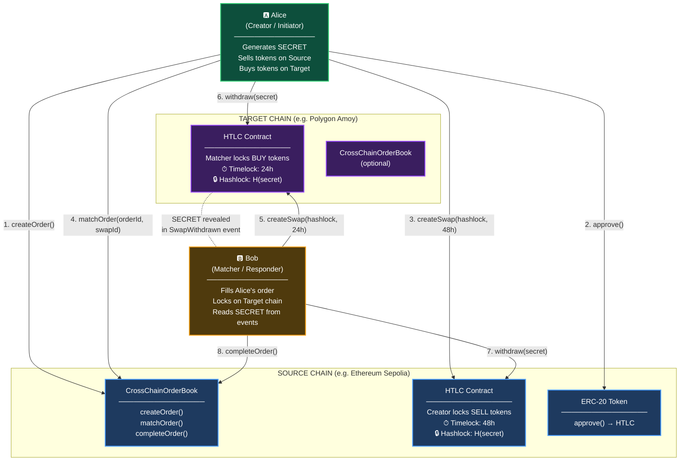
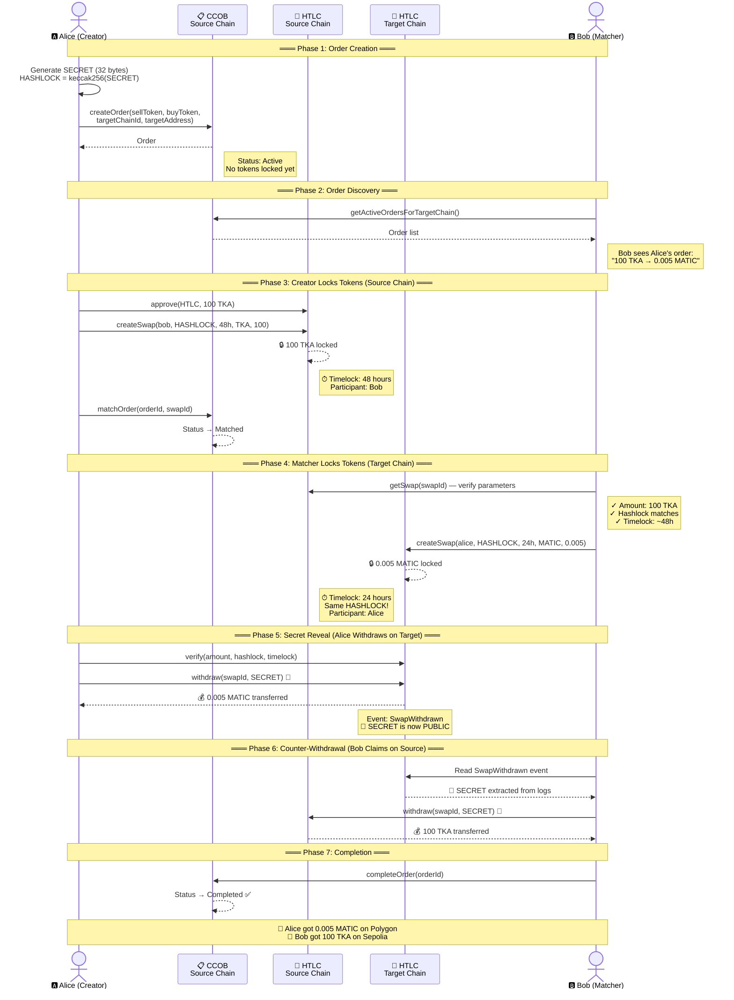
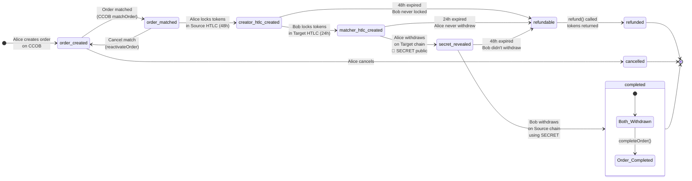
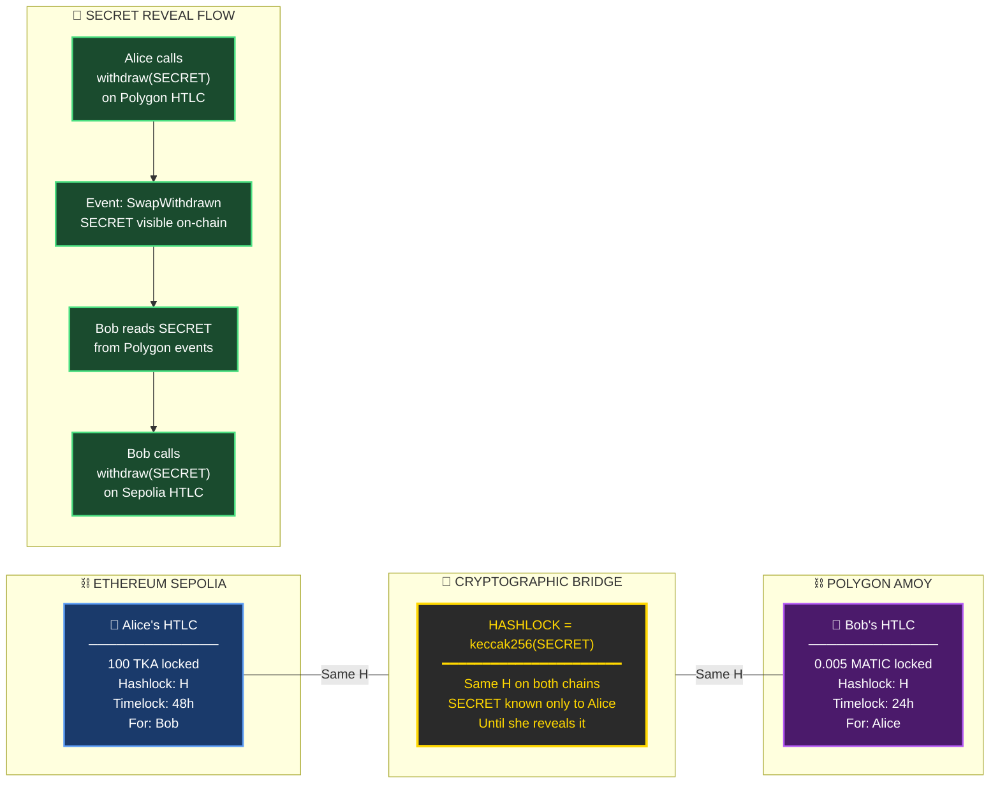
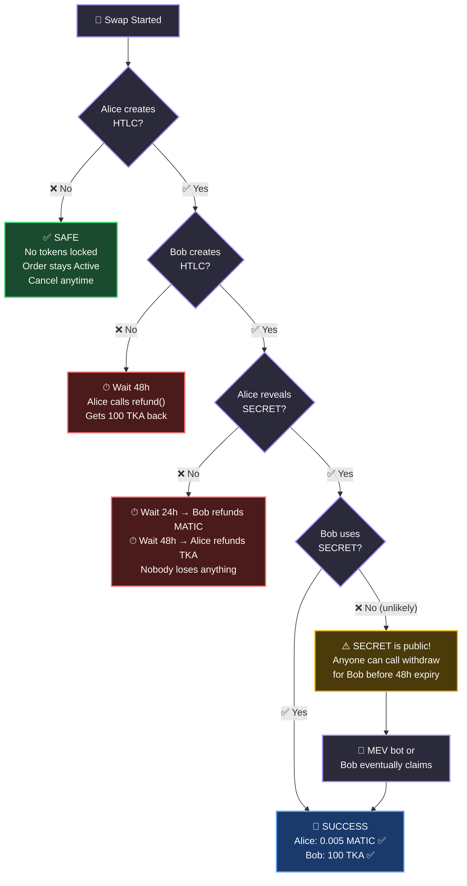
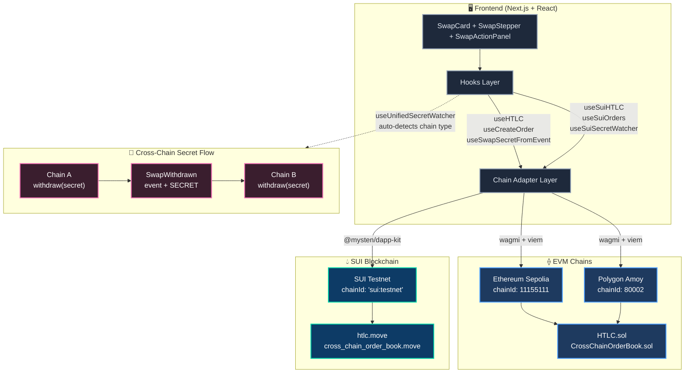

# HTLC Cross-Chain Atomic Swap — Visual Flow

## 1. High-Level Architecture



---

## 2. Full Swap Sequence Diagram



---

## 3. Swap Phase State Machine



---

## 4. Timelock Safety Design

```mermaid
gantt
    title Timelock Timeline — Why Matcher's Timelock Must Be Shorter
    dateFormat HH:mm
    axisFormat %H:%M

    section Alice's HTLC
    Alice locks 100 TKA (Source Chain)          :alice_lock, 00:00, 48h
    Alice can REFUND after 48h                  :crit, alice_refund, after alice_lock, 1h

    section Bob's HTLC
    Bob locks 0.005 MATIC (Target Chain)        :bob_lock, 02:00, 24h
    Bob can REFUND after 24h                    :crit, bob_refund, after bob_lock, 1h

    section Actions
    Alice MUST withdraw before Bob's expiry     :active, withdraw_window, 02:00, 24h
    Bob reads SECRET and withdraws              :done, bob_withdraw, 10:00, 2h
```



```
           Timeline:

    T+0h                    T+24h                   T+48h
     │                        │                        │
     ├────── Bob's HTLC ──────┤                        │
     │   (Alice must act!)    │← Bob can refund        │
     │                        │                        │
     ├──────────────── Alice's HTLC ───────────────────┤
     │                                                 │← Alice can refund
     │                                                 │
     │  ✅ SAFE ZONE          │  ⚠️ DANGER ZONE        │
     │  Alice withdraws here  │  Only Alice's HTLC     │
     │  Bob reads secret      │  remains active        │
     │  Bob withdraws here    │                        │
```

---

## 5. Cross-Chain Communication — The Hashlock Bridge



---

## 6. Failure Scenarios & Safety Net



---

## 7. Multi-Chain Support — EVM + SUI



---

## 8. Transaction Summary

```
    ┌─────────────────────────────────────────────────────────────────────┐
    │                    8 On-Chain Transactions                          │
    ├─────┬───────┬──────────────┬──────────┬──────────────────────────────┤
    │  #  │ Actor │    Chain     │ Contract │         Action               │
    ├─────┼───────┼──────────────┼──────────┼──────────────────────────────┤
    │  1  │ Alice │ ⛓ Source     │   CCOB   │ createOrder()                │
    │  2  │ Alice │ ⛓ Source     │   TKA    │ approve(HTLC, amount)        │
    │  3  │ Alice │ ⛓ Source     │   HTLC   │ createSwap(48h) 🔒           │
    │  4  │ Alice │ ⛓ Source     │   CCOB   │ matchOrder(orderId, swapId)  │
    │  5  │  Bob  │ ⛓ Target     │   HTLC   │ createSwap(24h) 🔒           │
    │  6  │ Alice │ ⛓ Target     │   HTLC   │ withdraw(SECRET) 🔑💰        │
    │  7  │  Bob  │ ⛓ Source     │   HTLC   │ withdraw(SECRET) 🔑💰        │
    │  8  │  Any  │ ⛓ Source     │   CCOB   │ completeOrder() ✅           │
    └─────┴───────┴──────────────┴──────────┴──────────────────────────────┘

    Alice: 4 tx (steps 1-4, 6)    Bob: 3 tx (steps 5, 7, 8)
```

---

## 9. The Secret — Heart of the Atomic Swap

```
    ┌───────────────────────────────────────────────────────────────┐
    │                                                               │
    │   SECRET  ━━━━━━━━━━━━━━━━━━━━━━━━━━━━━━━━━━━━━━━━━━━━━━━━  │
    │   0xa1b2c3d4e5f6...  (32 random bytes)                       │
    │                                                               │
    │            │                                                  │
    │            ▼  keccak256()                                     │
    │                                                               │
    │   HASHLOCK ━━━━━━━━━━━━━━━━━━━━━━━━━━━━━━━━━━━━━━━━━━━━━━━  │
    │   0x7f8e9d...  (deterministic hash)                           │
    │                                                               │
    │            │                                                  │
    │            ▼  Used in BOTH HTLCs                              │
    │                                                               │
    │   ┌──────────────────┐        ┌──────────────────┐           │
    │   │  Source HTLC     │        │  Target HTLC     │           │
    │   │  hashlock: H     │◄──────►│  hashlock: H     │           │
    │   │  100 TKA locked  │  SAME  │  0.005 MATIC     │           │
    │   │  for Bob         │   H    │  locked for Alice │           │
    │   └──────────────────┘        └──────────────────┘           │
    │                                                               │
    │   ┌─────────────────────────────────────────────────────┐    │
    │   │  ATOMICITY GUARANTEE:                                │    │
    │   │  • SECRET unlocks BOTH contracts                     │    │
    │   │  • Revealing it on one chain = revealing everywhere  │    │
    │   │  • Either both withdraw, or both refund              │    │
    │   └─────────────────────────────────────────────────────┘    │
    │                                                               │
    └───────────────────────────────────────────────────────────────┘
```
